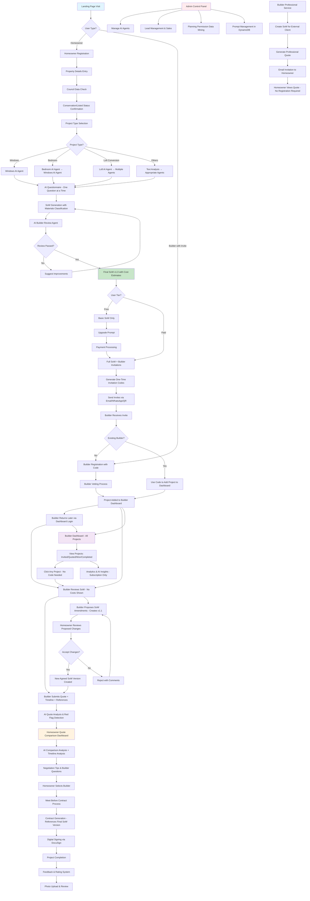
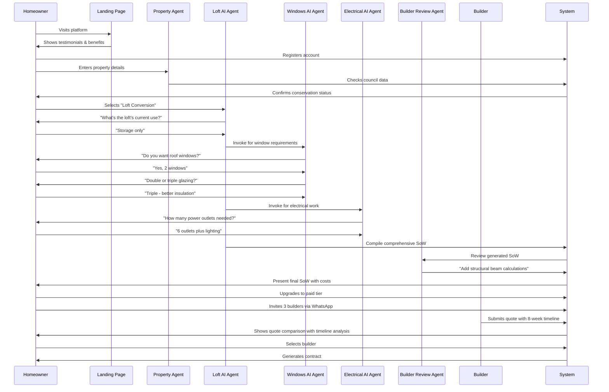
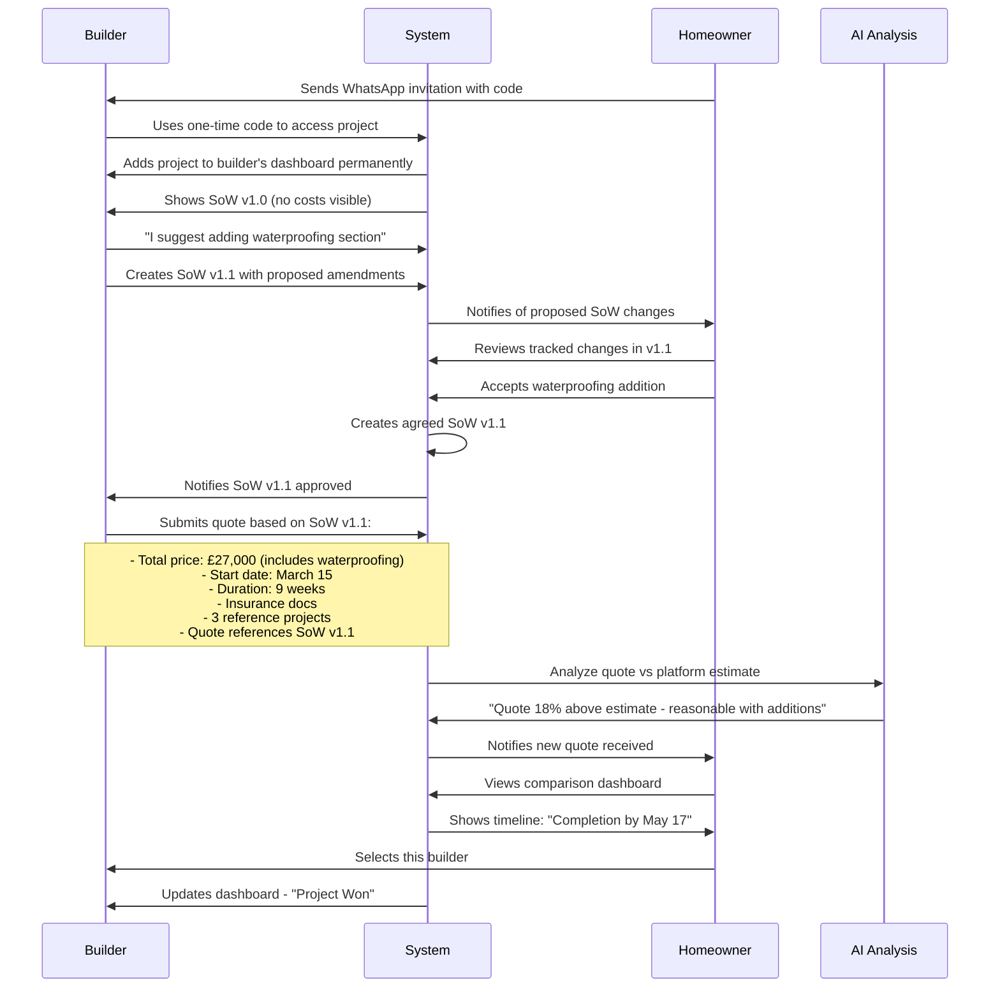
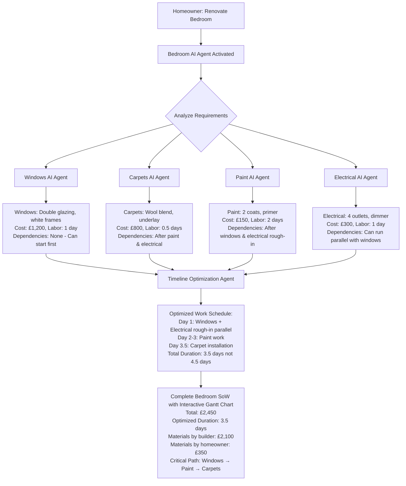
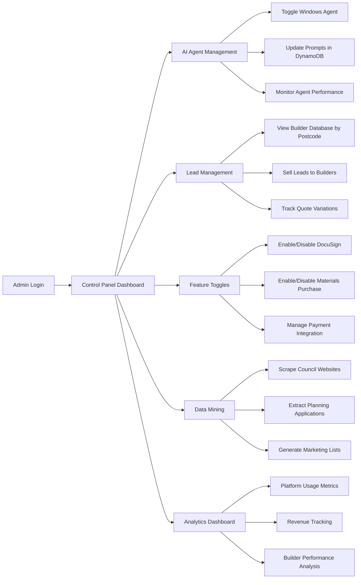
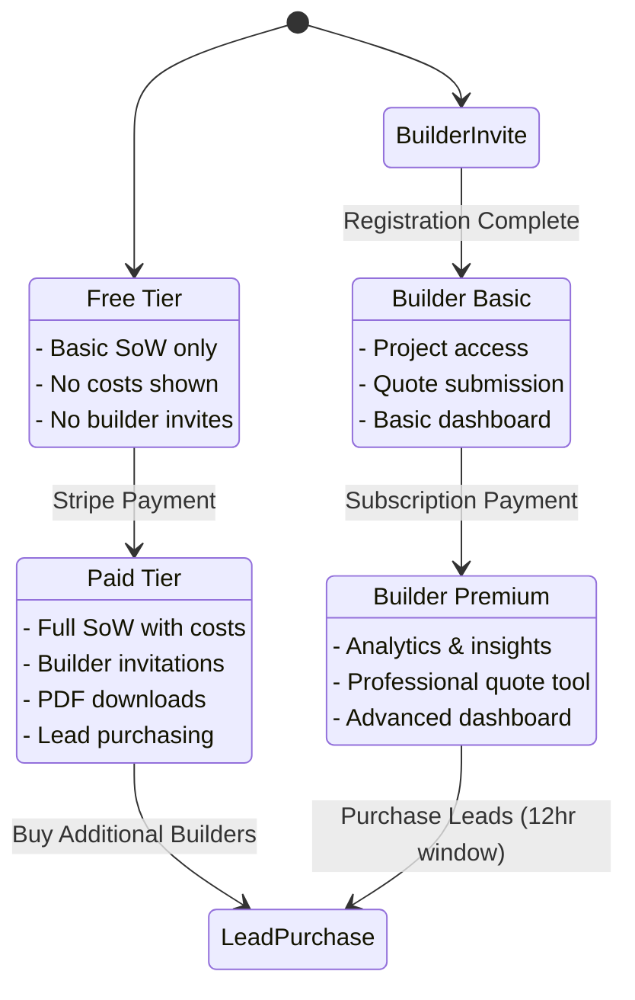
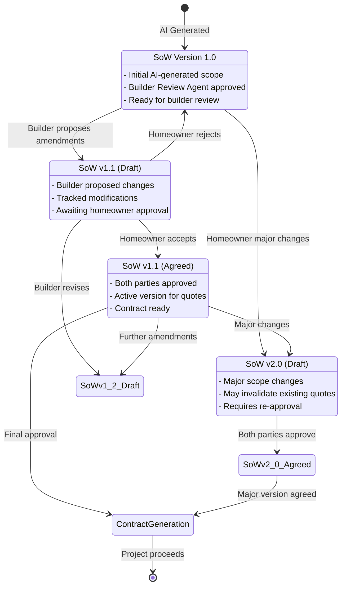

# UK Home Improvement Platform - User Journey Visualization

## Complete End-to-End User Flow

## Detailed User Stories Flow

### 1. Homeowner Journey - Loft Conversion Example

### 2. Builder Journey - Initial Invitation and SoW Collaboration

### 3. Multi-Agent Coordination - Bedroom Renovation with Intelligent Timeline

#### Timeline Optimization Logic

```mermaid
gantt
    title Bedroom Renovation - Optimized Timeline
    dateFormat X
    axisFormat %d
    
    section Parallel Phase
    Windows Installation    :active, windows, 0, 1d
    Electrical Rough-in     :active, electrical, 0, 1d
    
    section Sequential Phase  
    Paint Work             :paint, after windows electrical, 2d
    
    section Final Phase
    Carpet Installation    :carpet, after paint, 0.5d
    
    section Total Duration
    Project Complete       :milestone, complete, after carpet, 0d
```

### 4. Admin Control Flow

### 5. Payment & Subscription Flows

### 4. SoW Version Control and Collaborative Editing Flow

### 5. Admin Control Flow

### 6. Payment & Subscription Flows

## Key Integration Points

### AI Agent Ecosystem
- **Specialized Agents**: Windows, Carpets, Tiling, Paint, Electrical, Plumbing
- **Orchestrating Agents**: Bedroom, Kitchen, Bathroom, Loft Conversion
- **Review Agents**: Builder Review Agent validates all SoW with quality indicators
- **Analysis Agents**: Quote comparison, timeline analysis, red flag detection

### Data Flow Architecture
- **DynamoDB**: Stores prompts, projects, SoW versions with change tracking, contracts, user data
- **AWS Cognito**: Authentication for homeowners and builders
- **Stripe**: Payment processing for both user types
- **External APIs**: Council websites, WhatsApp, DocuSign
- **AI Services**: AWS Bedrock for all AI agent interactions
- **Version Control**: Complete audit trail of SoW modifications with timestamps and user attribution

### Communication Channels
- **Email**: Formal notifications, invitations, and SoW change notifications
- **WhatsApp**: Quick invitations and updates
- **SMS**: Urgent notifications and SoW approval alerts
- **In-Platform**: Dashboard notifications, status updates, and collaborative editing interface

### SoW Collaboration Features
- **Version Control**: Complete tracking of all SoW modifications with version numbers
- **Change Tracking**: Visual highlighting of modifications similar to document editors
- **Collaborative Editing**: Both homeowners and builders can propose amendments
- **Approval Workflow**: Digital approval process for version agreement
- **Audit Trail**: Complete history of who made what changes and when
- **Quote Integration**: Builders specify which SoW version their quotes are based on

This visualization shows how all 20 requirements work together to create a seamless collaborative experience from initial property assessment through project completion and feedback, with robust version control ensuring all parties stay aligned on project scope.